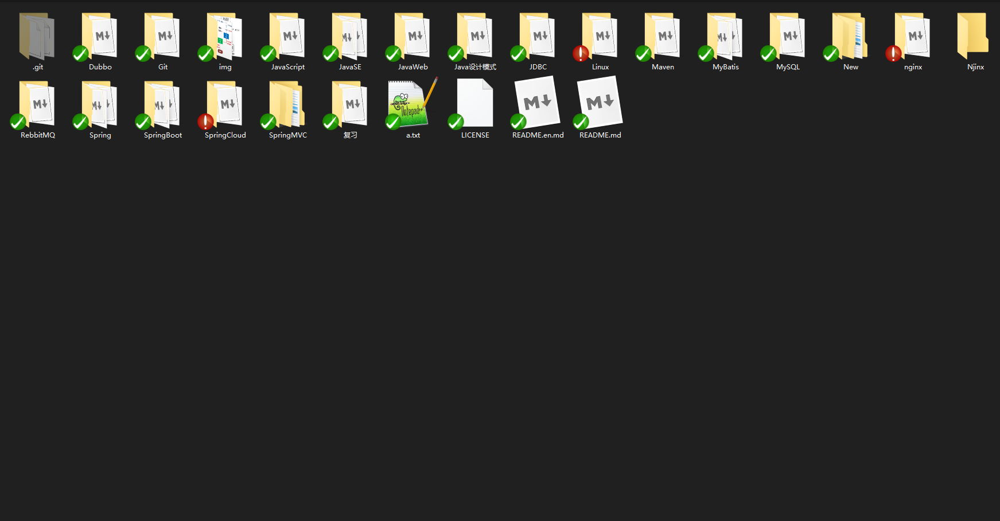

# 这是一个专属于芝麻盐的博客

这个小破站就是我芝麻盐专属的一亩三分地

为啥会搭建一个博客呢？

初衷是为了整理学习笔记，因为我的学习笔记整的实在是是的太太太乱了！

到底有多乱！

看图..............................................

在一个就是保存的问题了，万一电脑有个三长两短，资料全没了！我这小心脏可受不了奥。

开始想的是把笔记全都上传到GitHub上，但是每次都要拉去上传的太麻烦了啊！

所以就有了一个搭建博客的想法！

于是就整了一个

---

没想到这玩意越整越好看

于是又有了一个想法

..........................................

太晚了！明天写！

